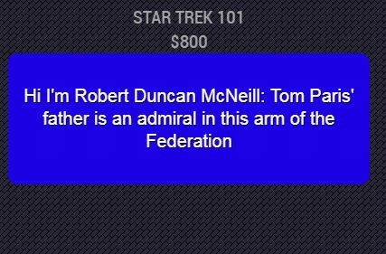
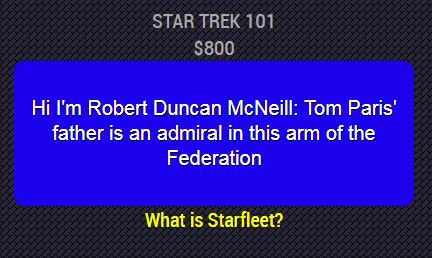

## MMM-JEOPARDY-Cluebase

Fork of  MMM-JEOPARDY-Enhanced  which was based on MMM-JEOPARDY

Spanning more than 40 years, the widely popular game show comes to your Magic Mirror.
With more than *350,000* clues and answers from the show.

Based on MMM-JEOPARDY by mkyle1, but styled to look like Jeopardy clues (MMM-JEOPARDY-Enhanced) and pulling Jeopardy data from Cluebase API: https://cluebase.readthedocs.io/en/latest/

## How it works

Just like the show, you are presented with a category and a value for the clue in that category.
The clue is given. You have a specified amount of time to respond before the answer appears. 
Then it's on to the next category and clue. 
Fast pace. Challenging. Educational. Fun!

## Examples

* Before answer and after answer appears

, 

* Annotated .css file included for aligning and coloring text and header.

## Installation

* `git clone https://github.com/fering3/MMM-JEOPARDY-enhanced` into the `~/MagicMirror/modules` directory.

* No API needed!

*Note*: The node_helper module needs the 'request' library, which may have to be installed explicitly

## Config.js entry and options

    {
        module: 'MMM-JEOPARDY',
        position: 'top_left',                  // Works well anywhere
        config: { 
		    useHeader: false,              // true if you want a header
                header: "This is Jeopardy!",   // Any text you want
		    maxWidth: "250px",             // Stretch or constrain according to region
		    animationSpeed: 3000,          // New clue fades in and out
        }
    },
	

## Special thanks to SpaceCowboysDude
